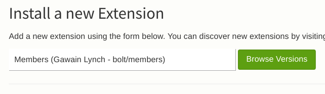
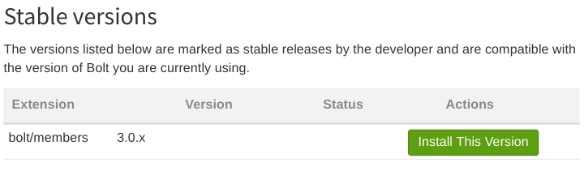
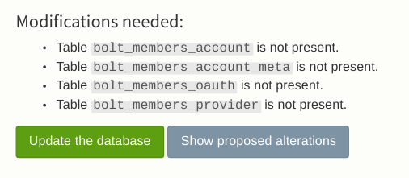

Installation
------------

Installation is fairly straightforward.

From the *Extend* page in the admin section of your Bolt site, type and select 
"auth" and click the "Browse Versions" button.

Then select an appropriate stable, or development (unstable), version for install.

#### IMPORTANT: Database Check & Update

Once complete, visit the *Database check & update* page as you will have 
database tables that need added to the database in order for Auth to 
function.

Should you be presented with an update notice, for example:

Then you should run the update. 

