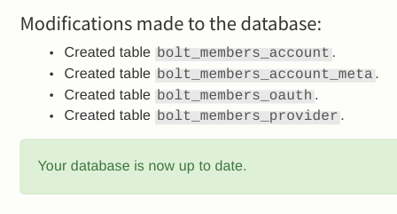

Quick Start Guide
-----------------


The default Twig templates in Members have been done with Bolt's base theme
(currently`base-2016`) in mind. 

If you are setting up Members for the first time, you may find it useful to 
first test on a site set up to run the current base theme, and then switch over
when you're happy with how it is working.

* [Install the extension](#install-the-extension)
* [Update database](#update-database)
* [Enable a provider](#enable-a-provider)
* [Enable registration](#enable-registration)
* [Templates](#templates)
  * [Authentication](#authentication)
  * [Profiles](#profiles)
* [Set up initial test greeting](#set-up-initial-test-greeting)
* [Registering your first user](#registering-your-first-user)
* [Final words](#final-words)


#### Install the extension
 
See the [installation page](installation.md), and ensure you've updated the site's database 

Enable [debug mode](debugging.md) to get additional feedback from Members during
set up.


#### Update database




#### Enable a provider

Set up the [Local provider](authentication-providers.md), and set `enbled: true` 

```yaml
providers:
    local:
        enabled: true
        keys:
            client_id: localdefault
            client_secret: localdefault
        scopes: [ user ]
```


#### Enable registration

In order to register your first account, you need to enable registration in 
your Members configuration file, e.g.:

```yaml
registration:
    enabled: true
```

**Note:** If you get 404 responses when trying to visit the registration URL,
you potentially forgotten to enable this.


#### Templates

Templating is very configurable. At a minimum, Members needs "parent"
templates to inherit layout from.  

Usually the parent role is split in two groups, "authentication", and "profiles".

By default, Members will use its own minimal parent templates that extend the
Bolt base theme's master template.

However if you wish to create your own, just set the relative path to them in
your theme directory in Members configuration file, e.g.:

```yaml
templates:
    authentication:
        parent: members/_authentication.twig
    profile:
        parent: members/_profile.twig
```

Finally add the blocks from the sections below to your desired position your
custom parent template.


##### Authentication

```twig
    {# Password & OAuth2 provider login forms #}
    
    

    {# Logout form #}
    
    

    {# Password recovery forms #}
    
    
```


##### Profiles

```twig
    {# Membership profile edit & view forms #}
    
    
```


#### Set up initial test greeting

**NOTE:** Do not attempt to complete this section by adding this Twig snippet
to a HTML field in a ConentType record … It will **not** work.

Add the snippet below somewhere in a template for an existing URL, and browse to the URL. 

```twig
    
        

        <p>Hello, {{ member.displayname }}. You were last seen at {{ member.lastseen }},
        logging on from {{ member.lastip }}, and your email is {{ member.email }}</p>
    
        <p>Welcome visitor from the Internet!</p>
    
```

When you've not yet registered and logged in, you should see the message 
"Welcome visitor from the Internet!" displayed. 

Upon login (still coming below), refreshing this page should display the
personalised greeting.


#### Registering your first user

If everything so far has worked, you should now be able to visit the
registration page, by default found at the URI `/membership/profile/register`

You will require a valid email address, e.g. DNS has a valid mail server 
registered. Meaning `@example.com` won't work


#### Final words

The following links might be good next places to look: 

* [Form Display](form-display.md) gives details on customising Twig template rendering 
* [Twig Functions](twig-functions.md) provides a list of available Twig template functions
* [Authentication Providers](authentication-providers.md) for details on adding OAuth2 providers like Facebook & Google
* [Routes & URLs](routes-urls.md) if you'd like to understand, or customise, some of the routes used by Members
* [Example: Menu Entries](examples/menu.md) gives a small example of a menu for Members specific entries 
